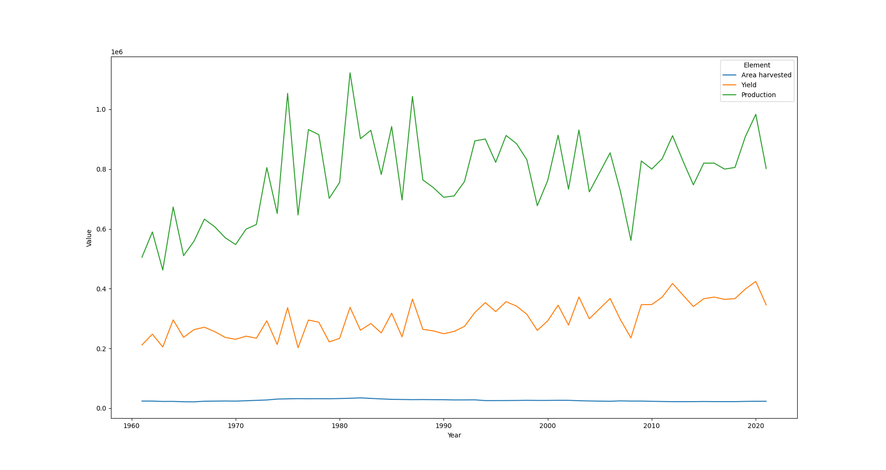
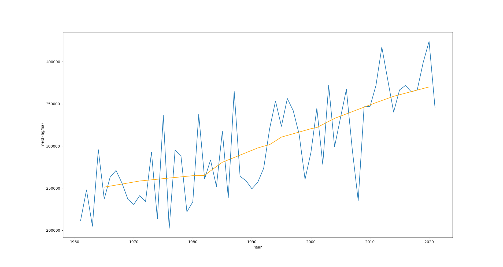

# Crop Yield
This application uses multivariate linear regression to predict lemon/lime yield in the United States given year and area harvested in an effort to solidify some of the concepts I've learning in Chapter 3 of [ISLR](https://www.statlearning.com/). While the data is hard to follow and predict by eye, the model was able to reach an $ R^2 $ value of 0.71. 

The data was taken from the [Food and Agricultural Organization of the United Nations](https://www.fao.org/faostat/en/#data/QCL)

## Process
### Reviewing the Data
Using `df.describe(inclue="all")`, I was able to take a look at the data I was provided. I noticed that a lot of the columns showed data that was the same for every row, so I eliminated them. I then plotted the values:

### Cleaning
From there, I realized I needed to transform my date from long to wide form, so I used `pd.pivot` to make that happen. I also added units to the different measurements and rearranged the indices. 

The predictors, Area Harvested (ha) and Year, were meant to predict Yield (hg/ha)

### Training the Model, Assessing Accuracy
After splitting the data into training and testing sets, I trained the model, plotted the predictions, and calculated $R^2$, which turned out to be pretty decent at 0.712.

Note: My initial plan was to do a hypothesis test to see prove a relationship, but since `scikit-learn` has no functions that would do it for me, I decided to opt for an $R^2$ score

